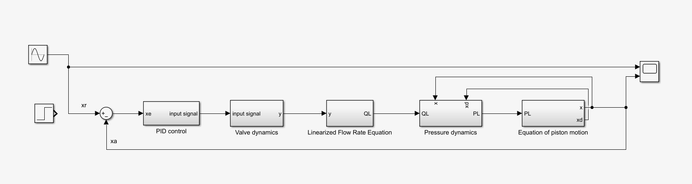
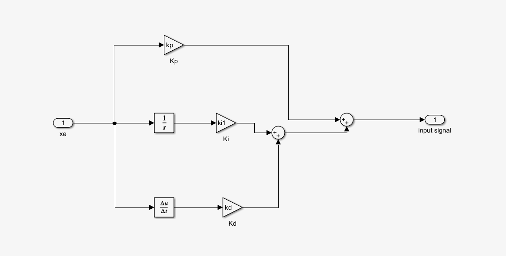
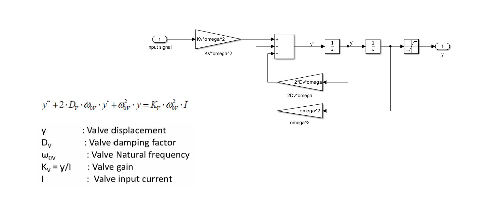
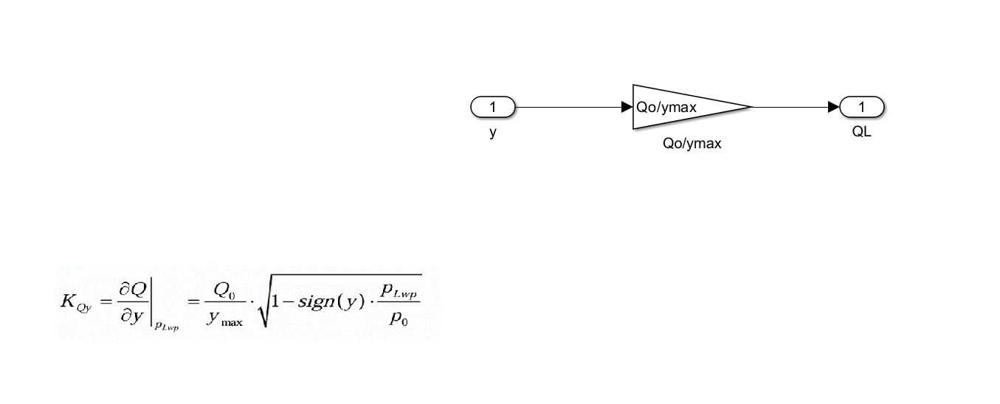
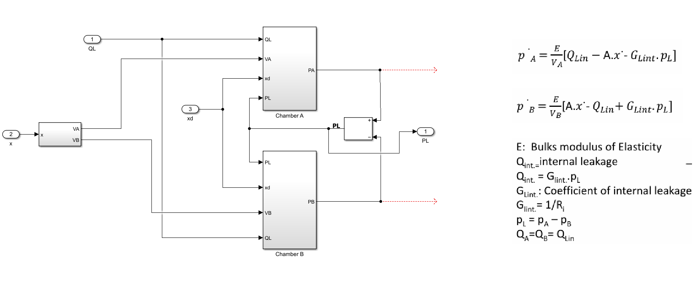
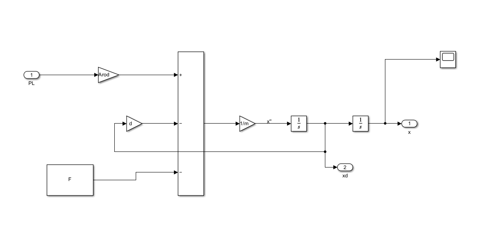
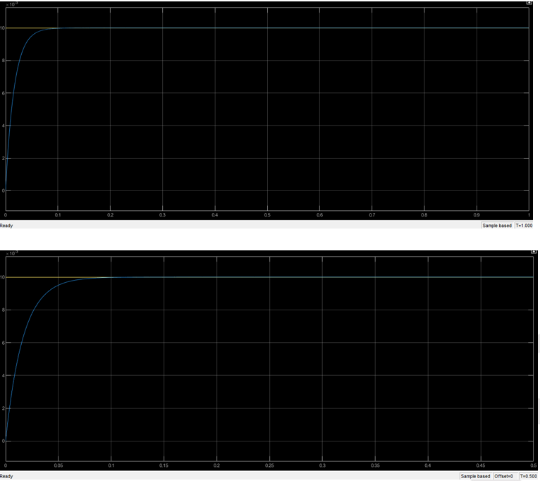
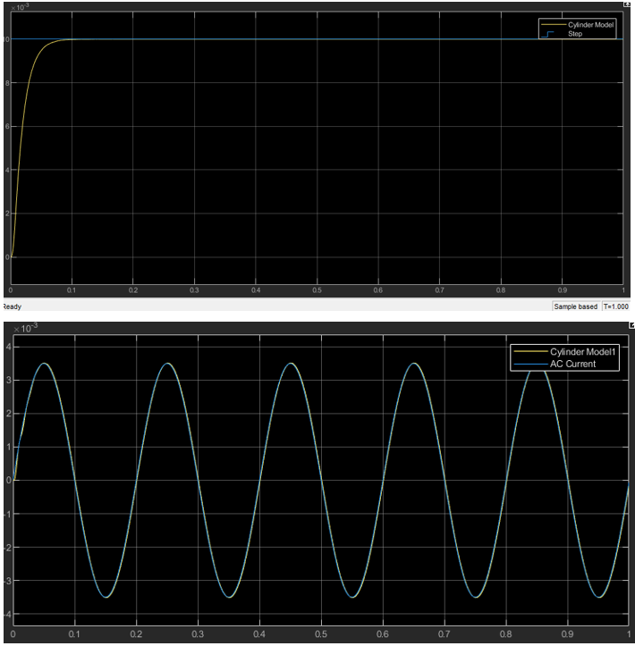
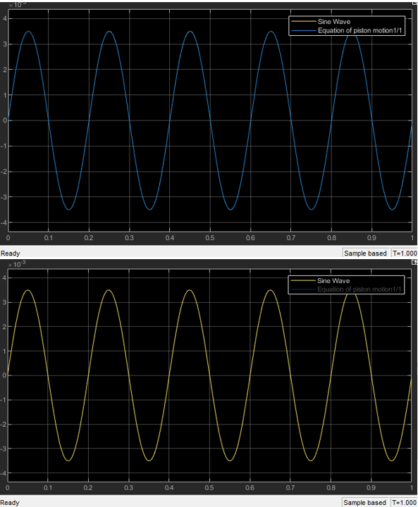
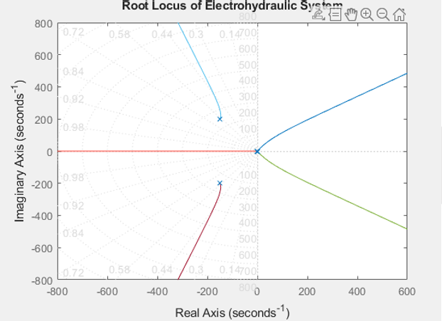

# Backup-Roll Balancing — Servo-Hydraulic Control with dSPACE HIL

Closed-loop **servo-hydraulic position control** for the backup-roll balancing system of a steel rolling mill, designed in **MATLAB/Simulink** and validated by **Hardware-in-the-Loop (HIL) on a dSPACE DS1104** with ControlDesk real-time monitoring.

> Industrial-scale electrohydraulics: a nonlinear plant model, linearised controller design, and a real-time HIL validation loop hitting **< 0.5 s settling and < 10 % overshoot**.

---

## Problem

In a rolling mill, the **backup roll (~5,000 t-class assembly, modelled at 5,000 kg)** must be held in precise vertical position against large, varying loads. A servo valve meters hydraulic flow to balancing cylinders; the controller must keep position stable and well-damped despite an **over-balancing force of 50 kN** and nonlinear valve/flow behaviour.

## System parameters

| Quantity | Value |
|----------|-------|
| Roll assembly mass | 5,000 kg |
| Over-balancing force | 50,000 N |
| Cylinder bore / rod | Ø 380 / 360 mm |
| System pressure | 290 bar |
| System flow rate | 111 L/min |
| Discharge coeff. α | 0.7 |
| Spool dia. Ds | 4.6 mm |
| Fluid density ρ | 867 kg/m³ |

## Approach

1. **Plant modelling** — built a **nonlinear Simulink model** of the servo valve + cylinder: flow–pressure relation `Q = α·Ds·π·y·√(2/ρ)·√(P/2)`, effective piston/rod areas, and load dynamics.
2. **Linearisation** — linearised the flow about the working point (`y=0, P_L=0`) to a `Q_L = K_QY·y − K_QP·P_L` form for controller design.
3. **Controller design** — derived the open-loop transfer function and set **PID gain ranges** (Kp up to 2000, Ki up to 1000); placed gains using **root-locus / Bode** stability analysis.
4. **HIL validation** — deployed the controller to a **dSPACE DS1104**, with the hydraulic plant (servo valve, cylinder, position/pressure sensors) in the loop and **ControlDesk** for real-time monitoring and tuning.

## Test campaign & results

| Test | Condition | Result |
|------|-----------|--------|
| Step input | 3.5 mm, no-load & 50 kN load | **Settling time < 0.5 s** |
| Step input | 3.5 mm | **Overshoot < 10 %** |
| Sine tracking | 5 Hz | Stable tracking, margins verified |

Stability confirmed via root-locus and Bode plots; performance held under both no-load and fully loaded (50 kN) conditions.

## HIL setup

- **Hardware:** servo valve, hydraulic cylinder (Ø 380/360 mm), position & pressure sensors, **dSPACE DS1104**
- **Software:** MATLAB/Simulink (nonlinear valve model, PID, stability analysis), **ControlDesk** (real-time monitoring)

## Tech stack

`MATLAB` · `Simulink` · `dSPACE DS1104` · `ControlDesk` · servo-hydraulics · classical control (root locus / Bode)

## Repository contents

| File | Description |
|------|-------------|
| [simulink/CVCmodel.slx](simulink/CVCmodel.slx) | Full Simulink model (open in MATLAB) |
| [simulink/parameters.m](simulink/parameters.m) | All model parameters (PID gains, valve, cylinder, fluid) |
| [docs/Circuit.pdf](docs/Circuit.pdf) | Hydraulic circuit diagram |
| [docs/Project_circuit.ct](docs/Project_circuit.ct) | ControlDesk experiment layout |
| [docs/Backup_Roll_Balancing_Presentation.pptx](docs/Backup_Roll_Balancing_Presentation.pptx) | Project presentation |

### Simulink model diagrams

**Full closed-loop system**

**PID Controller**

**Valve Dynamics** — `y'' + 2·Dv·ω·y' + ω²·y = Kv·ω²·I`

**Linearised Flow Rate** — `QL = (Qo/ymax)·y`

**Pressure Dynamics** — Continuity eq. for Chamber A & B

**Equation of Piston Motion** — `m·x'' = Arod·PL − d·xd − F`

## Results

**Step response — piston motion**

**Step + sine wave — cylinder motion**

**Sine tracking — piston motion**

**Bode plot**

## Still to add

- [ ] ControlDesk screenshot

---

*Mechatronics project — backup-roll balancing, supervised by Dr. Eng. Taher Salah El-Din.*
